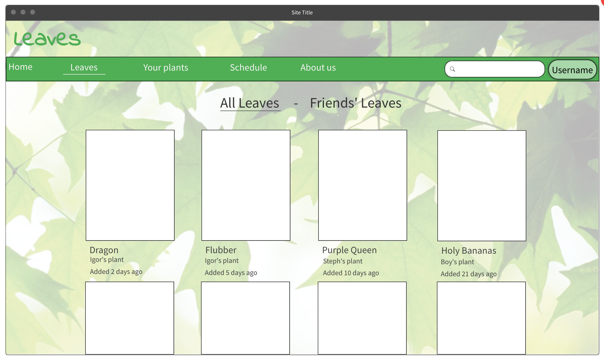
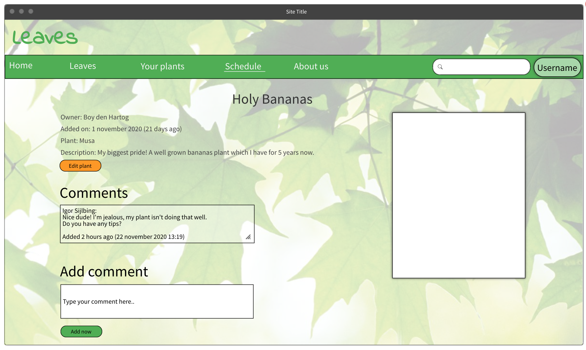
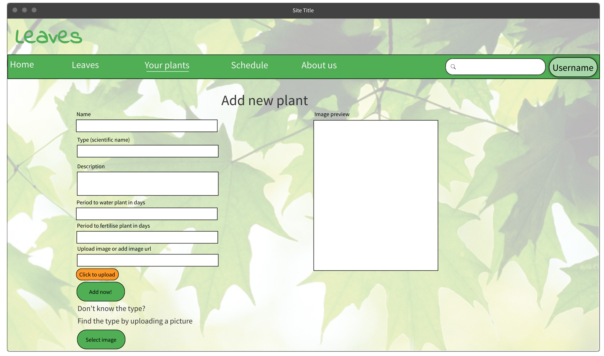
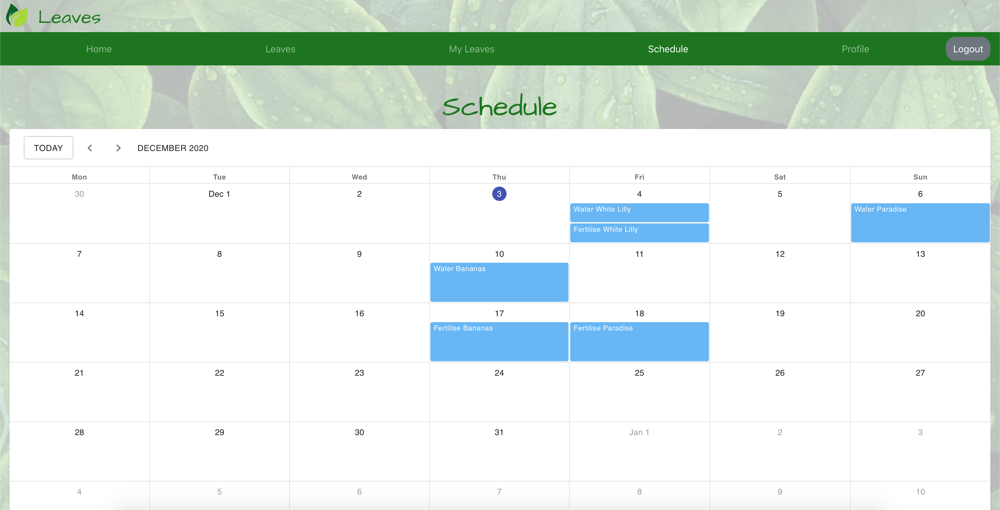

# 🌱 Leaves - A plant lovers community 🌿

## 🍀 What is this app about?

[Check out the online running version now!](https://leaves-community.netlify.app/) 
Login with r@k.com, password: kebab

Leaves is a social platform where you can share your (favorite) plants with others users and friends. On the homepage a view popular suggestions are displayed if you are looking for a new plant. On the 'Leaves' page you can see all plants users added to share with the community.

When signed up and logged in, users can see all plants users added or a selection of users you are following. When clicking on a plant you can see more detailed information a user added to the plant and you can leave a comment.

A user can add a new plant to their collection, upload a picture of it and search for the species by uploading a picture. It will give you a couple of results with a percentage of the likeliness of the species. By adding reminders and a period, a user can get reminded by email when to water or fertilize a plant. The reminder will automatically be moved the X amount of days entered.

## 🍀 Contents

🌵 [Project goals](#project-goals)

🌵 [Technologies & concepts](#technologies-and-concepts)

🌵 [User stories](#user-stories)

🌵 [Wireframe](#wireframe)

🌵 [Project board](https://github.com/users/TSKraak/projects/1)

🌵 [Database tables model](https://dbdiagram.io/d/5fbba5c73a78976d7b7d0b61)

🌵 [Screenshots](#screenshots)

🌵 [Backend server repo](https://github.com/TSKraak/Leaves-server)

## 🍀 Project goals

The goal of this project is to build a full-stack app, practicing known and exploring new technologies. I learned these new tools independently by reading its documentation, consultin forums and watching online videos.

- Practice full-stack app development
- Build a working prototype in 2 weeks
- Apply what we learned in Codaisseur's bootcamp
- Extend with new technology independently
  - Using TypeScript for the first time
  - Implementing the use of an API to search for plant species
- Showcase and document development skills using:
  - Wireframes as Minimum Viable Product
  - Conscious data model design
  - User stories perspective
  - Agile/[Kanban project](https://github.com/users/TSKraak/projects/1) approach
  - Transparant and structured git version control

## 🍀 Technologies and concepts

- [React for UI building](https://github.com/TSKraak/Leaves-client/blob/development/src/App.tsx)
- [Redux for state management](https://github.com/TSKraak/Leaves-client/tree/development/src/store)
- [TypeScript for productivity and debugging](https://github.com/TSKraak/Leaves-client/tree/development/src/store/plants) ✨
- [Authentication Front-End](https://github.com/TSKraak/Leaves-client/tree/development/src/store/user)
- [Authentication Middleware Back-End](https://github.com/TSKraak/Leaves-server/blob/development/auth/middleware.js)
- [Express as web app framework](https://github.com/TSKraak/Leaves-server/blob/development/index.js)
  - [REST API](https://github.com/TSKraak/Leaves-server/tree/development/routers)
- [Sequelize as ORM](https://github.com/TSKraak/Leaves-server/tree/development/migrations)
- [Many-to-many models for following users](https://github.com/TSKraak/Leaves-server/tree/development/models)
- [React Scheduler with Material UI](https://github.com/TSKraak/Leaves-client/blob/development/src/pages/MySchedule/index.tsx) ✨
- [API implementation to find plant species](https://github.com/TSKraak/Leaves-client/blob/development/src/components/FindPlantSpecies/index.tsx) ✨
- [Cloudinary Image uploader widget](https://github.com/TSKraak/Leaves-client/tree/development/src/components/ImageUploader) ✨

✨ New used technologies

## 🍀 User stories

- As a visitor I want to be able to sign up and create a profile.
- As a registered user I want to be able to login.
- As a user I want to
  - be able to edit my profile information.
  - see some popular plants suggestions on the homepage.
  - view plants from other users and from people/friends I follow.
  - see plant detail information when I click on a users plant.
  - be able to add a new plant to my collection.
  - search for the species of my plant.
  - see an overview of the plants I added.
  - have a schedule displaying when to water/fertilize plants.
  - get email reminders when to water/fertilize a plant.

## 🍀 Wireframe

[Online version here](https://wireframepro.mockflow.com/view/M45f9db447a4540a4a3e44ede2265032c1605616416653#/page/14658da0ef0144c4976d7b18f9769b1c)

## 🍀 Screenshots

